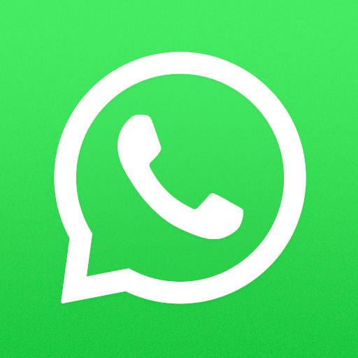
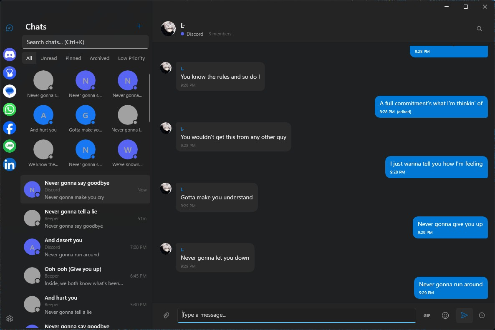

# Buzzr: Native Beeper Client for Windows ⚡

</br>

[](https://learn.microsoft.com/en-us/dotnet/csharp/)
[](https://go.dev/)
[](https://learn.microsoft.com/en-us/windows/apps/winui/winui3/)
[](https://dotnet.microsoft.com/)
[](LICENSE)

Buzzr is a native Windows 11 desktop client for [Beeper](https://beeper.com), the unified messaging platform.\
It aggregates all your chats (Discord, WhatsApp, Telegram, Signal, Instagram, Messenger, and more) into a single, beautiful WinUI 3 interface.\
Built from scratch with a Go sidecar bridge that handles the Matrix protocol, so you get real-time messaging with a native Windows experience.

> [!WARNING]
> Buzzr is currently in **early development**. Expect rough edges. Breaking changes may happen between versions.

---

## Features ✨

- [x] **Unified inbox** - All your networks in one sidebar (Discord, WhatsApp, Telegram, Signal, Instagram, Messenger, Line, LinkedIn, Twitter, Google Messages)
- [x] **Real-time messaging** - WebSocket-powered live updates
- [x] **Rich media** - Images, videos, GIFs (via Klipy), voice messages with inline playback
- [x] **Reactions** - Send and receive emoji reactions
- [x] **Replies & quotes** - Reply to messages with quote previews
- [x] **Edit & delete messages** - Modify or remove sent messages
- [x] **@Mentions** - Autocomplete mentions in group chats
- [x] **Markdown support** - Quote blocks, text formatting
- [x] **Chat management** - Pin, mute, archive, mark as read
- [x] **Drag-and-drop pins** - Reorder pinned chats and network sidebar
- [x] **Message search** - Search within conversations
- [x] **Scheduled messages** - Send messages at a specific time
- [x] **GIF picker** - Search and send GIFs with Klipy integration
- [x] **Notifications** - Native Windows App Notifications
- [x] **Dark theme** - Material Design 3 dark mode with system accent colors and Mica backdrop
- [x] **Censor mode** - Randomize text for privacy during screen recordings
- [x] **Built-in terminal** - Debug terminal with custom commands
- [x] **Local database** - SQLite caching for offline message access
- [x] **Avatar caching** - Cached profile pictures for better performance
- [x] **Auto-login** - Saved authentication tokens between sessions

## Supported Networks 🌐

| | Network | | Network | | Network |
|---|---|---|---|---|---|
|  | Discord |  | WhatsApp |  | Telegram |
|  | Instagram |  | Messenger |  | Twitter / X |
|  | LINE* |  | LinkedIn |  | Google Messages |

...and any other network supported by Beeper's bridge infrastructure.

*LINE is currently only supported via the unofficial [matrix-line-bridge](https://github.com/highesttt/matrix-line-messenger)

## Screenshots 🖼️

<table>
  <tr>
    <td align="center"></td>
  </tr>
  <tr>
    <td align="center">Unified inbox with network icons, pinned chats, and dark theme</td>
  </tr>
</table>

## Requirements 📋

- Windows 10 21H2 or later (Windows 11 recommended)
- An active [Beeper](https://beeper.com) account
- .NET 8 Runtime (bundled in self-contained builds)

**For building from source:**

- .NET 8 SDK
- Go 1.25+
- GCC / MinGW (for CGO, required by the sidecar's SQLite dependency)

## Installation 🚀

### Portable

1. Download the latest `Buzzr-x.x.x-x64-portable.zip` from [Releases](../../releases)
2. Extract to any folder
3. Run `Buzzr.exe`

### MSI Installer

1. Download the latest `Buzzr-x.x.x-x64.msi` from [Releases](../../releases)
2. Run the installer. It will guide you through setup
3. Buzzr is installed to `Program Files\Buzzr` with Start Menu and Desktop shortcuts

### MSIX Installer

1. Download the latest `Buzzr-x.x.x-x64-installer.zip` from [Releases](../../releases)
2. Extract and run `install.ps1` as Administrator:

   ```powershell
   Set-ExecutionPolicy Bypass -Scope Process -Force
   .\install.ps1
   ```

3. The script will install the certificate and register the MSIX package

### Build from source 🧑‍💻

1. Clone the repository:

   ```bash
   git clone https://github.com/highesttt/Buzzr.git
   cd Buzzr
   ```

2. Build the sidecar:

   ```bash
   cd sidecar
   CGO_ENABLED=1 go build -o buzzr-sidecar.exe .
   cd ..
   ```

3. Build and run the app:

   ```bash
   dotnet build Buzzr/Buzzr.csproj -p:Platform=x64
   dotnet run --project Buzzr/Buzzr.csproj -p:Platform=x64
   ```

4. Or build a full release (portable + MSIX + MSI):

   ```bash
   # portable + MSIX
   ./build.sh --platform x64 --config Release

   # include MSI installer (requires WiX: dotnet tool install --global wix)
   ./build.sh --platform x64 --config Release --msi

   # or build MSI standalone
   .\build-msi.ps1 -Platform "x64"
   ```

## Suggestions and Contributions 💡

If you have any suggestions for improvements or new features, feel free to open an issue or submit a pull request on the [GitHub repository](https://github.com/highesttt/Buzzr).

## Commit norms 📝

Every commit message should be made using `git-cz` and should follow the `.git-cz.json` config file.
